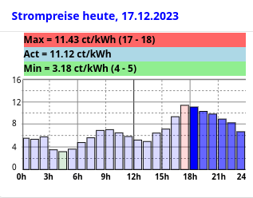

Known Issues:
Bar plot won't show negative prices

**Installation:**

1) Install aWATTar Binding https://home.myopenhab.org/settings/addons/binding-awattar
2) Add Things:
   
   a) Add an "aWATTar Bridge" thing. Leave default Lable "aWATTar Bridge" , modify Country and VAT and base price to your needs
   
   b) Add an "aWATTar Stundenpreise" thing. Leave default Lable "aWATTar Stundenpreise".  Set Parent Bridge field to the aWATTar Bridge created in Pt. 2a.
4) Create Items
   
   a) Add aWATTar Stundenpreise items. In Things select "aWATTar Stundenpreise" thing, go to Channels, scroll to the bottom of page 
      and do "Add Equipment to Model". Select all 49 "Gross Total" points (or do a "Select All" to select all points - but this creates much more items than needed...)
	  Click "Add to Model" button
   
   b) Add special aWATTar items used in bar grap. In developer tools go to "Add Items from Textual Definition" page . 
      Copy and insert all lines from "items_awattar_add.txt" to Add Items from Textual Definition window.
	  Press "Add" top add the 20 items.
6) Add rAwattarhelper Rule. Go to Rules in Setup and press "+" to add a rule.
   Insert rAwattarhelper into Name filed.
   
   a) Click Select a Trigger....Time Event ... Build a cron expression to run every 5 Minutes
      Cron expression should look like: 0 0/5 * * * ? *
      (!! Not: * 0/5 * * * ? *   !! which would run each second every 5 Minutes)
   
   b) Add an Action....Run Script ...Rule DSL .... insert all lines from "rAwattarhelper.js" into the editor
      Click on "Save" !
   You may test the rule by clicking on the Run button and check that rule does generate a Event log line showing Rule rAwattarhelper last run time.
8) Add 2 Custom Widgets. In developer tools go to "Widgets" page.
   
   a) Press "+" button to add a Widget. Exchange standard code with all lines from awattar_graph_today_eho_v0_1.yaml. Press Save. Go Back
   
   b) Press "+" button to add a Widget. Exchange standard code with all lines from awattar_graph_tomorrow_eho_v0_1.yaml. Press Save. Go Back
   
10) Add Widgets to a MainUI Layout or tabbed Page.
   Select one of the just created Widgets "awattar_graph_today_eho_v0_1" or "awattar_graph_tomorrow_eho_v0_1".
   Configure the Widgets. You may insert code from Stompreise_heute.yaml for todays widget or from Stompreise_morgen.yaml for tomorrows widget.
   
   
