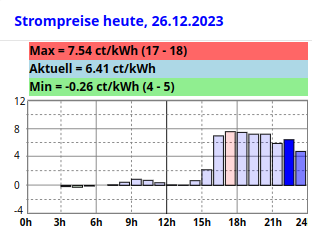
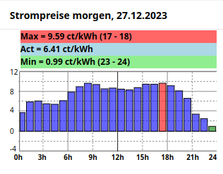

### Widgets snapshots:
  
Above shown: Today Widget /  Tomorrow Widget with data / Tomorrow Widget with no data

 

Above shown: Today Widget containing negative prices /  Tomorrow Widget containing negative prices (both Version v0_2)

### Installation:
Version v0_3 adds average price calculation and shows this right after actual price.

##### 1) Install aWATTar Binding (https://www.openhab.org/addons/bindings/awattar/)
##### 2) Add Things: 
 a) Add an "aWATTar Bridge" thing. Using UI, leave default lable "aWATTar Bridge" , modify country and VAT and base price to your needs
   
 b) Add an "aWATTar Stundenpreise" thing. Leave default lable "aWATTar Stundenpreise".  Set parent bridge field to the aWATTar bridge created in Pt. 2a.
##### 3) Create Items:
 a) Add aWATTar Stundenpreise items.
 
In Things select "aWATTar Stundenpreise" thing, go to Channels, scroll to the bottom of page 
and do "Add Equipment to Model". Select all 49 "Gross Total" points - 1 for current, 24 for today and 24 for tomorrow. You may also do a "Select All" to select all points - but this will create much more items than needed....)
Click "Add to Model" button. 

This creates and links the items. Also a Group Equipment named "aWATTar_Stundenpreise" is created.
   
 b) Add special aWATTar items used in bar graph. 
 
 In developer tools go to "Add Items from Textual Definition" page . 
Copy and insert all lines from "items_awattar_add.txt" to Add Items from Textual Definition window.
Press "Add" top add the 25 items.
##### 4) Add "rAwattarhelper" Rule (cron triggered Rule DSL script):
   Go to Rules in Setup and press "+" to add a rule. Insert **rAwattarhelper** into Name filed.
   
 a) Add a cron trigger:
 
 Click Select a Trigger....Time Event ... Build a cron expression to run every 5 Minutes

Cron expression should look like: 0 0/5 * * * ? *
(Note not: * 0/5 * * * ? *   !! which would run each second every 5 Minutes)
      
Running rule every 5 minutes is not mandatory, rule should run at least every 1 hour. Alternatively to cron based trigger one can also use a "When an Item state changes" trigger and pin this to item aWATTar_Stundenpreise_Current_Totalgross .
   
 b) Add an Action
 
 Run Script ...Rule DSL .... insert all lines from "rAwattarhelper.js" into the editor. Click on "Save" !
   
 You may test the rule by clicking on the Run button and check that rule does generate a Event log line showing Rule rAwattarhelper last run time. To do this: Login to openhab operating system with ssh and issue "openhab-cli showlogs" command.
   
##### 5) Add the 2 Custom Widgets for today and tomorrow prices. 

In developer tools go to "Widgets" page.
   
   a) Press "+" button to add a Widget. Exchange standard code with all lines from **awattar_graph_today_eho_v0_2.yaml**. Press Save. Go Back
   
   b) Press "+" button to add a Widget. Exchange standard code with all lines from **awattar_graph_tomorrow_eho_v0_2.yaml**. Press Save. Go Back
   
##### 6) Add Widgets to a MainUI Layout or tabbed Page.
    
   After pressing "+" to add a card, select one of the just created Widgets "awattar_graph_today_eho_v0_2" or "awattar_graph_tomorrow_eho_v0_2".
   Configure the Widgets. 
   
   You may insert code from Stompreise_heute.yaml for todays widget or from Stompreise_morgen.yaml for tomorrows widget.
   
### Notes:

Widgets and rAwattarhelper rule are based on standard Item names created by aWATTar binding, which builds item names for hourly prices like: *aWATTar_Stundenpreise_Today00_Totalgross* or *aWATTar_Stundenpreise_Tomorrow14_Totalgross* . If your aWATTar Items do not follow this naming convention then the widget can be modified using its parameters for Prefix, Prefix_Today and Postfix. The Item names in the rule must be edited manually to match different naming conventions. **Item names are case sensitive (so mind upper case "WATT" in "aWATTar....")**

### OpenHAB Commuinity Link:
https://community.openhab.org/t/bar-chart-showing-awattar-hourly-prices/152171
